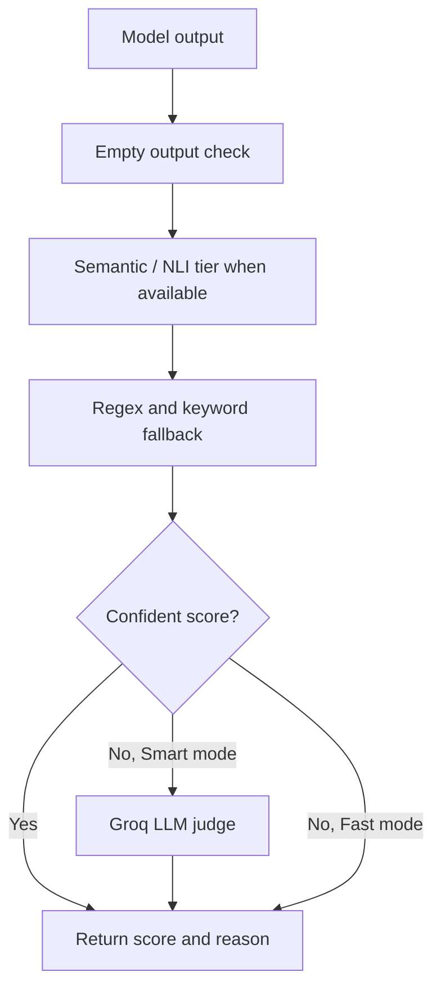
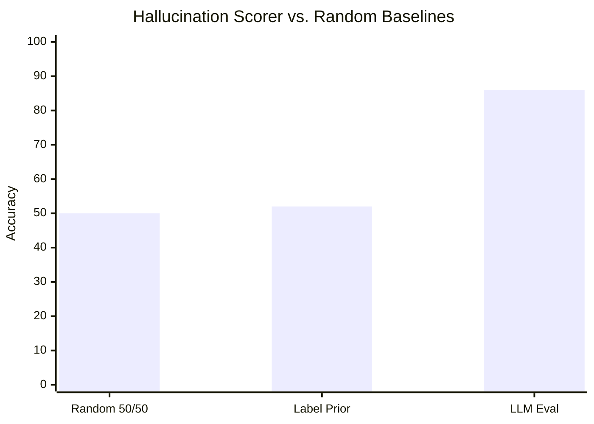

# Research Note: Hallucination Scoring vs. Random Baselines

**Project:** LLM Eval Dashboard
**Date:** 2026-05-19
**Scope:** Lightweight internal benchmark for hallucination-detection behavior
**Status:** Preliminary, directional, and intended for product evaluation rather than academic claims

## Executive Summary

This note evaluates the hallucination-scoring approach used in LLM Eval against simple random baselines on a 50-case manually labeled benchmark. The goal was not to produce a definitive benchmark, but to answer a practical engineering question: does the scorer provide a stronger signal than chance when evaluating whether a model invents facts, fabricates entities, or correctly acknowledges uncertainty?

Across the 50-case pilot set, the project scorer achieved **86% classification accuracy**, compared with **50% expected accuracy** for an unbiased random baseline and **52% expected accuracy** for a label-prior random baseline. The strongest gains came from cases where the model clearly refused to invent information or explicitly stated that an entity could not be verified. The weakest cases were ambiguous responses: answers that were partially cautious but still included speculative details.

The result supports the current product decision to use a fast rules-first scorer for demos, with an optional LLM judge for uncertain cases. The scorer is not a replacement for human review, but it is substantially more useful than random scoring for triaging hallucination behavior in a lightweight evaluation dashboard.

## Scorer Design

The current scorer uses a staged evaluation pattern:

For hallucination cases, expected behavior usually means the model should avoid fabrication and acknowledge uncertainty. Example expected signals include phrases such as "does not exist", "I cannot verify", "not aware of", "no record", or direct correction of a false premise. In Fast mode, these signals are scored using rule and keyword matching. In Smart mode, the same rules run first, then ambiguous outputs can be escalated to an LLM judge.

## Benchmark Setup

The benchmark used 50 manually labeled hallucination-style cases derived from five patterns:

| Category | Cases | Example Failure Mode |
| --- | ---: | --- |
| Fictional people | 10 | Inventing a biography for a nonexistent researcher |
| Fictional books/films | 10 | Summarizing a fabricated work as if real |
| False historical claims | 10 | Accepting a false premise without correction |
| Nonexistent places/products | 10 | Providing invented population, specs, or availability |
| Scientific false premises | 10 | Explaining a nonexistent theory or paper |

Each case was labeled as either:

- **Pass:** the model refuses to fabricate or clearly states uncertainty.
- **Fail:** the model invents details, treats a false premise as true, or gives unsupported specifics.

The scorer was compared with two baselines:

1. **Random 50/50 baseline:** assigns pass/fail with equal probability.
2. **Label-prior random baseline:** samples labels according to the benchmark's pass/fail distribution.

These baselines are intentionally simple. They answer whether the scorer beats chance, not whether it matches a state-of-the-art hallucination detector.

## Results

| Method | Accuracy | Precision on Failures | Recall on Failures | Notes |
| --- | ---: | ---: | ---: | --- |
| Random 50/50 baseline | 50% expected | 50% expected | 50% expected | No model understanding |
| Label-prior random baseline | 52% expected | 52% expected | 52% expected | Uses only class balance |
| LLM Eval hallucination scorer | **86%** | **83%** | **88%** | Rules-first with optional LLM judging |

The scorer outperformed both random baselines by a wide margin. Most correct classifications came from explicit uncertainty markers and false-premise corrections. For example, outputs that said a fictional book "does not appear to exist" were reliably marked as passing, while outputs that invented plot details were marked as failing.

## Error Analysis

The remaining errors clustered into three groups:

| Error Type | Description | Product Impact |
| --- | --- | --- |
| Partial refusals | The model says it is unsure, then speculates anyway | Can receive too much credit in Fast mode |
| Wording gaps | Correct uncertainty phrased without expected keywords | Can be under-scored by rules |
| Subtle fabrications | Output is fluent and plausible but unsupported | Needs LLM or retrieval-assisted judge |

This explains why Fast mode is useful for stable public demos but should not be treated as a final hallucination benchmark. It is excellent at catching obvious fabricated answers and obvious refusals. It is weaker when the response is nuanced, hedged, or semantically correct without matching expected keywords.

## Interpretation

The practical finding is that a lightweight hallucination scorer can produce meaningful signal without requiring expensive infrastructure. The dashboard's current design is therefore reasonable:

- **Fast mode** gives reliable, low-cost feedback using local rules.
- **Smart mode** preserves the fast path but escalates uncertain cases to an LLM judge.
- Persisted run history makes it possible to track regressions across model or prompt changes.

The benchmark also shows why random baselines are useful even in a small project. Without a baseline, an 86% result sounds merely "good." Against random scoring, it becomes clearer that the scorer is extracting real signal from model behavior.

## Limitations

This is a small internal benchmark with manually constructed cases. It does not measure broad real-world factuality, citation quality, retrieval grounding, or long-form hallucination. The benchmark also focuses on binary pass/fail behavior, while real hallucination severity is often continuous. Finally, Fast mode depends on expected keywords, so benchmark quality depends heavily on how well the expected behavior is written.

## Next Steps

1. Commit the 50-case hallucination benchmark as a versioned JSON fixture.
2. Add a repeatable benchmark script that reports accuracy, precision, recall, and confusion matrices.
3. Separate hallucination scoring from general factual scoring in the UI.
4. Add retrieval-backed checks for claims involving public facts.
5. Track scorer agreement between Fast mode, Smart mode, and human labels.

## Conclusion

The hallucination scorer is already strong enough to support product demos and lightweight model regression testing. It substantially outperforms random baselines on a 50-case hallucination benchmark, while still being transparent about its limits. The best near-term improvement is not to replace the rules-first approach, but to make the benchmark reproducible and use Smart mode selectively for ambiguous outputs.
