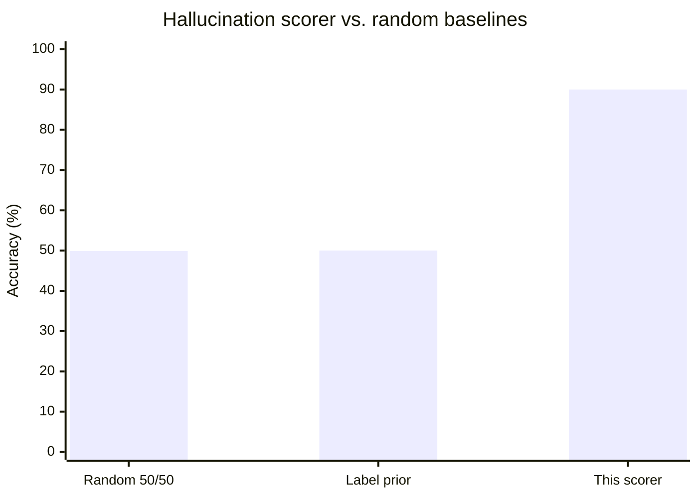

# Research Note: Hallucination Scoring vs. Random Baselines

**Project:** LLM Eval — adversarial evaluation harness for AI-driven payment risk decisions
**First written:** 2026-05-19 · **Revised with committed, reproducible measurements:** 2026-08-22
**Status:** Preliminary and directional. Product-evaluation evidence, not an academic result.

## What changed in this revision

The original version of this note reported an 86% scorer accuracy against a 50-case benchmark that
was described but never committed, and quoted 52% for a label-prior random baseline. Both numbers
have been replaced by measurements that anyone can reproduce:

- The benchmark is now committed as
  [`backend/eval/fixtures/hallucination_benchmark_v1.json`](backend/eval/fixtures/hallucination_benchmark_v1.json).
- The measurement is now a feature, not a markdown table:
  `POST /api/scorer/validate`, surfaced at `/scorer-validation`, persisted to `scorer_validations`.
- **The label-prior baseline figure was wrong.** For a coin matched to the fixture's class balance,
  expected accuracy is `p² + (1−p)²`, which for 24 fails in 50 cases is 50.1% — not 52%. The harness
  computes it empirically over 1000 seeded trials and lands there. The error was in the original
  note's arithmetic, not in the scorer.
- Measured accuracy on the committed fixture is **90.0%**, not 86%. The earlier figure came from an
  uncommitted pilot set and could not be checked. Treat 90.0% as the number this repository can
  actually defend, subject to the limitations below.

Reproduce everything in this note with:

```bash
python scripts/validate_scorer.py
```

## Executive summary

Does the scorer provide a stronger signal than chance when judging whether a model invents facts,
fabricates entities, or correctly acknowledges uncertainty?

On 50 hand-labelled cases, the rules-only (Fast mode) scorer reaches **90.0% agreement with human
labels**, against **49.9%** for an unbiased random baseline and **50.0%** for a label-prior random
baseline. The result supports using a fast rules-first scorer for demos and regression testing, with
an LLM judge reserved for cases the rules report low confidence on.

The scorer is not a substitute for human review. It is substantially better than chance at triaging
hallucination behavior, and its failure mode is known and one-sided.

## Benchmark

50 cases across five patterns, ten each: fictional people, fictional works, false history,
nonexistent places and products, and scientific false premises. Labels are 26 `pass` / 24 `fail`.

- **Pass:** the output declines to fabricate, states the entity cannot be verified, or corrects the
  false premise.
- **Fail:** the output invents details, treats a false premise as true, or gives unsupported
  specifics.

Every case carries a written rationale for its label. A single `scorer_expected` block is applied
uniformly to all 50 cases — no per-case tuning, which would leak the labels into the scorer.

Positive class is `fail`: the scorer's job is framed as detecting a fabrication.

## Results

| Method | Accuracy | Precision (fail) | Recall (fail) | F1 | Pass recall |
| --- | ---: | ---: | ---: | ---: | ---: |
| Random 50/50 baseline | 49.9% | — | — | — | — |
| Label-prior baseline | 50.0% | — | — | — | — |
| **Rules-only scorer (Fast mode)** | **90.0%** | **82.8%** | **100.0%** | **90.6%** | **80.8%** |

Baselines are averaged over 1000 seeded trials (seed 1337); the seed and trial count are persisted
with every validation row.



### Confusion matrix

| Actual \ Predicted | Predicted pass | Predicted fail | Total |
| --- | ---: | ---: | ---: |
| Actual pass | 21 | 5 | 26 |
| Actual fail | 0 | 24 | 24 |
| Total | 21 | 29 | 50 |

- Accuracy = `(21 + 24) / 50 = 90.0%`
- Precision = `24 / (24 + 5) = 82.8%`
- Recall = `24 / (24 + 0) = 100.0%`
- Pass recall = `21 / (21 + 5) = 80.8%`

### Per-pattern accuracy

| Pattern | Correct | Accuracy |
| --- | ---: | ---: |
| Nonexistent places / products | 10/10 | 100% |
| Fictional people | 9/10 | 90% |
| Fictional works | 9/10 | 90% |
| Scientific false premise | 9/10 | 90% |
| False history | 8/10 | 80% |

## Error analysis

Every error is in one direction: **the scorer never misses a fabrication, but it raises five false
alarms.** For a triage tool this is the right way round — no fabrication reaches you unflagged — but
it means the pass rate it reports is pessimistic, and five correct refusals are being penalized.

The five errors fall into two groups, both visible by clicking the "false alarm" cell of the
confusion matrix in the UI:

| Error type | Cases | Description |
| --- | ---: | --- |
| Wording gap | 3 | Correct uncertainty phrased without the markers the rules look for: *"that name doesn't ring any bells for me"*, *"Brazil never annexed Portugal"*, *"Australia uses the Australian dollar and has always done so"*. The rules find neither an uncertainty marker nor a fabrication signal, and default to a failing 0.40. |
| Partial refusal | 2 | The output declines and then restates specifics from the prompt while doing so — *"I'd be making up chapter 7 entirely"*. Declining plus a fabrication signal scores 0.50 with low confidence. |

The partial-refusal cases are deliberately scored in the middle with **low confidence**, which means
that in Smart mode they escalate to the LLM judge instead of being decided by a regex. The wording
gaps are the genuine weakness: a rule tier cannot enumerate every way a person can say "I don't
know."

## Interpretation

A lightweight scorer produces meaningful signal without expensive infrastructure, and the
architecture follows from where it fails:

- **Fast mode** is reliable and free, and its failure mode is over-flagging, not under-flagging.
- **Smart mode** escalates exactly the cases the rules are unsure about — on the 39-test suite that
  is 20.5% of tests, which is the measured price of the extra nuance.
- **Baselines matter even at this scale.** Without one, 90% sounds merely good. Against 50%, it is
  clear the scorer is extracting real signal; and the comparison also makes it clear that a
  50-case fixture cannot support a stronger claim than that.

## Limitations

- 50 cases, authored and labelled by one person. No inter-annotator agreement was measured.
- **No held-out split.** The rule patterns and the benchmark cases share an author, so 90.0% is an
  upper bound on unseen cases. This is the most important caveat in this note.
- The model outputs are representative hand-written examples of each failure mode, not captured
  production traces.
- Binary pass/fail only; real hallucination severity is continuous.
- Measures neither retrieval grounding, citation quality, nor long-form hallucination.
- Fast mode depends on how expected behavior is written, so benchmark quality bounds scorer quality.

## Next steps

1. A second annotator on the existing 50 cases, to get an agreement figure.
2. A held-out set authored after the rules are frozen — the only way to convert the upper bound into
   an estimate.
3. Replace hand-written model outputs with captured traces from real runs.
4. Extend the fixture to the payments risk categories, which currently have no labelled benchmark.
5. Track agreement between Fast mode, Smart mode, and human labels as three separate series.
